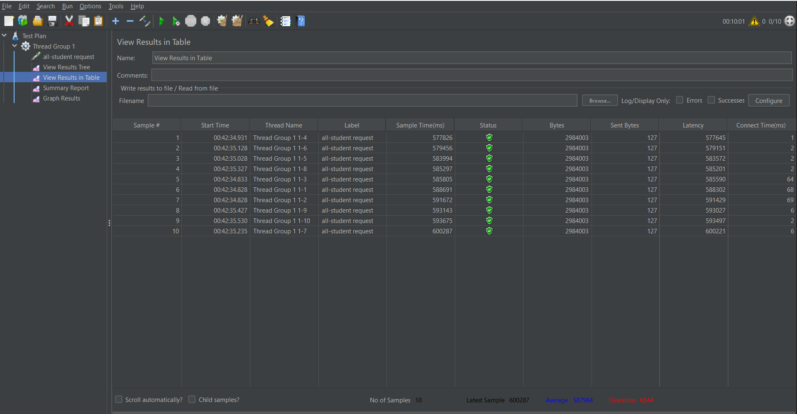
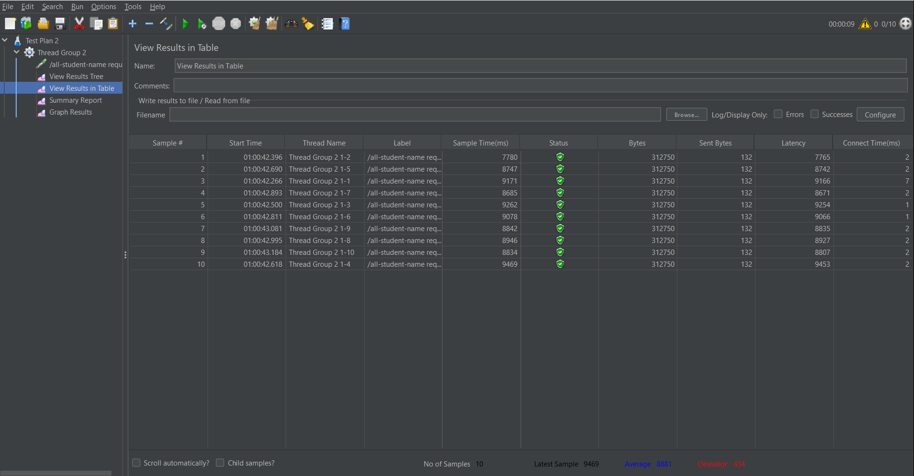
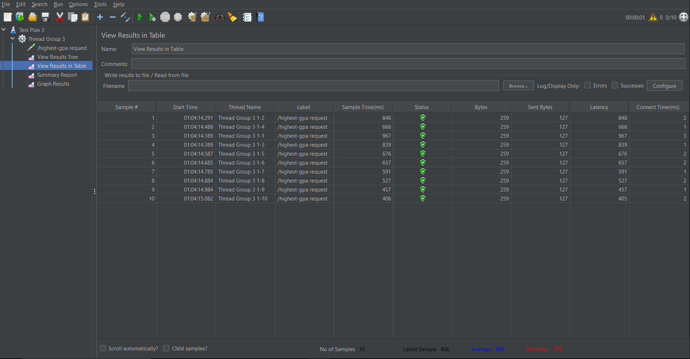
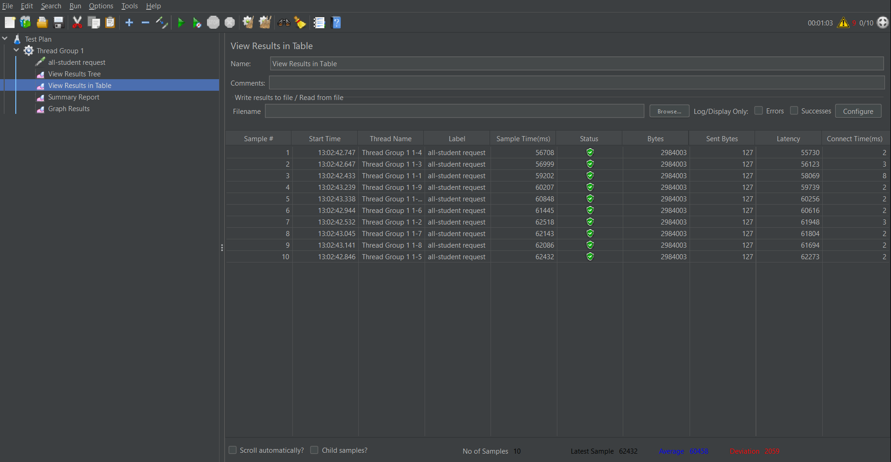
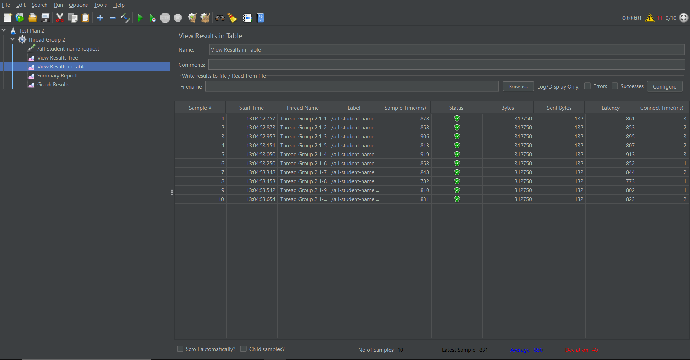

# Tutorial 5
Pada tutorial kali ini, saya belajar menggunakan JMeter dan IntelliJ Profiler untuk melakukan Performance testing.

## Performance Testing Results
### Before Optimized
1. /all-student request
    
2. /all-student-name request
    
3. /highest-gpa request
    

### After Optimized
1. /all-student request
   
2. /all-student-name request
   
3. /highest-gpa request
   

### Conclusion
Setelah melakukan optimization dapat disimpulkan bahwa program berjalan dan menghasilkan output dengan jauh lebih cepat dibandingkan dengan saat sebelum di-optimize.

## Reflection
1. Performance testing menggunakan JMeter berfokus untuk menilai performa sistem secara keseluruhan dengan mensimulasikan user interaction dan menghitung waktu respons dalam testing environment yang terkontrol. Sedangkan profiling menggunakan IntelliJ Profiler berfokus pada analisis yang lebih sempit/kecil seperti pada method dan proses.

2. Profiling sangat menmbantu dalam hal mengindentifikasi dan memahami weak points dari software yang sedang di-develop dengan menunjukkan waktu dan resources yang digunakan pada kode. Proses yang menghabiskan banyak waktu untuk diselesaikan biasanya mengalami bottleneck yang tidak dapat terlihat secara langsung. Nah dari situlah kita bisa refactor kode kita agar proses berjalan dengan baik.

3. Ya, karena sudah terintegrasi secara langsung IntelliJ tempat saya mengembangkan kodenya.

4. Jujur sejauh ini belum ada kesulitan dalam melakukan performance testing.

5. Sama seperti penjelasan saya di point 3. Proses Profiling menjadi mudah karena sudah terintegrasi langsung dengan development environment yang sedang digunakan.

6. Coba dibandingkan dengan hasil performance testing menggunakan JMeter. Selain itu, coba diperiksa kembali test plan yang sudah dibuat apakah sesuai dengan yang diinginkan atau tidak.

7. Pertama, saya lihat terlebih dahulu segmen mana saja yang perlu di optimize. Kemudian, saya coba optimize satu persatu. Setelah melakukan optimisasi, saya cek apakah hasil test-nya sudah sesuai. Apabila sudah sesuai, maka saya commit.